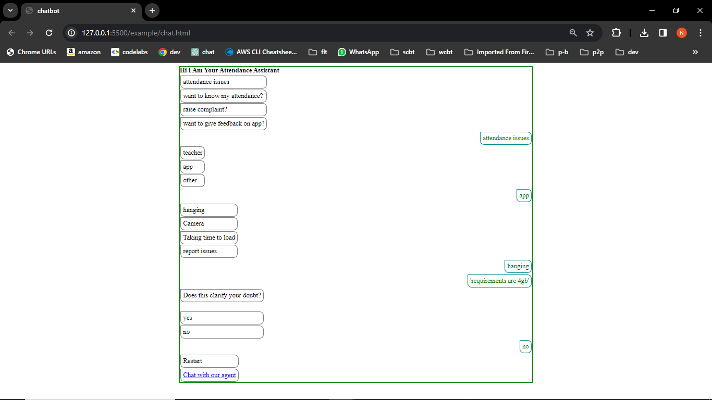

## Chatbot | Product Assistant | Helper
#  Introduction
In todays tech-driven landscape, it is become increasingly common for applications to feature a dedicated assistant or helper. Recognizing this trend, I have crafted a user-friendly chatbot package designed to seamlessly integrate chat functionality into your projects.

# Implementation
# 1.Linking Files
### 1.1 CDN Approach
To effortlessly incorporate the chatbot into your project, follow these simple steps:
#### Include CDN of  CSS ####
```
<link rel="stylesheet" href="https://cdn.jsdelivr.net/gh/pvscreations/chatbot@v1.0.2/lib/chat.css">

```
### Include CDN of Javascript ###
```
<script src="https://cdn.jsdelivr.net/gh/pvscreations/chatbot@v1.0.2/lib/chat.js"></script>
```
### 1.2.Downloading files to project source code
For a local implementation, download the required files from the following links:
* <a href="/../../releases/download/v1.0.2/chat.css">download chat css file here</a>
* <a href="/../../releases/download/v1.0.2/chat.js"> download chat js file here</a>
# 2.Initialising Chatbot
#### 2.1 .Define your questions and answers in a structured JSON format: ####
```
var content={
    "attendance issues": {
        "teacher": "database is down currently",
        "app": {
            "hanging": "requirements are 4gb",
            "report issues": {
                "on service": "database is down currently",
                "on help": "database is down currently"
            }
        },
        "other": "database is down currently"
    },
    "want to know my attendance?": {
        "yearly": "database is down currently",
        "monthly": "database is down currently",
        "todays": "database is down currently",
        "other": "database is down currently"
    },
    "raise complaint?": {
        "on faculty": "database is down currently",
        "on ams_app": "database is down currently",
        "other": "database is down currently"
    },
    "want to give feedback on app?": "database is down currently",
};
```
#### 2.2. Create an instance of the Chatbot with a chosen name (e.g., 'assistant'): ####
   * Here we create an instance
   ```
const assistant=new Chatbot(
        {
            content:content,
            container:document.getElementById("chat"),
            objectName:"assistant" //It is the object name you are creating here it is assistant you was creating line60
        },
        {
            welcomeMsg:"hi i am your attendance assistant",
            sendOfMsg:"goodbye",
            redirectLink:"realtimechat.html"
        }
    );
```
* Parameters Description
     * param1 is the required information to be sent to class
            * content is object of question and answers,
            * container is DOM element where chat will be rendered
            * objectname is name of the created chatbot
     * param2 is optional which is used to customize the chatbot
            *welcomeMsg describes the chatbot msg which is hi i am xyz
            *sendofmsg describes the final msg of chatbot like goodbye
            *redirectlink is the link at final stage where you want to redirect the chatbot

#### 2.3  Invoke the chatbot to come into effect ####

```
  /**
     * Here we call the chatbot to come into effect
    */
    assistant.initialise();
```
# Future Scopes
* <b> Value Added Service (VAS) </b>: Integrate a service for generating query and answer JSON objects.
* <b> Modularity in Styling</b> : Enhance styling modularity for a more adaptable design.
* <b> Cross-Platform Support</b> : Develop similar packages for Flutter, React Native, and React.
* <b> Analytics Integration </b>: Incorporate analytics for a deeper understanding of user interactions.

# References
* Explore the example to see how the chatbot's basic layout looks and functions. Feel free to leverage this powerful tool for a more engaging and interactive user experience in your projects!
  - ## <a href="https://pvscreations.github.io/chatbot_plugin_frontend_js/example/chat.html">Click here for Example</a>
  - ## <a href="/../../tree/main/example">Click here for Example Code</a>
